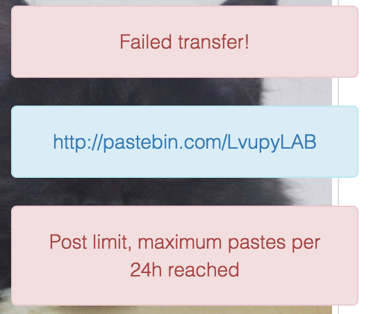
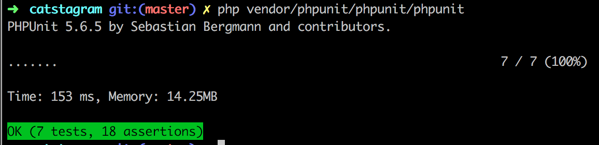
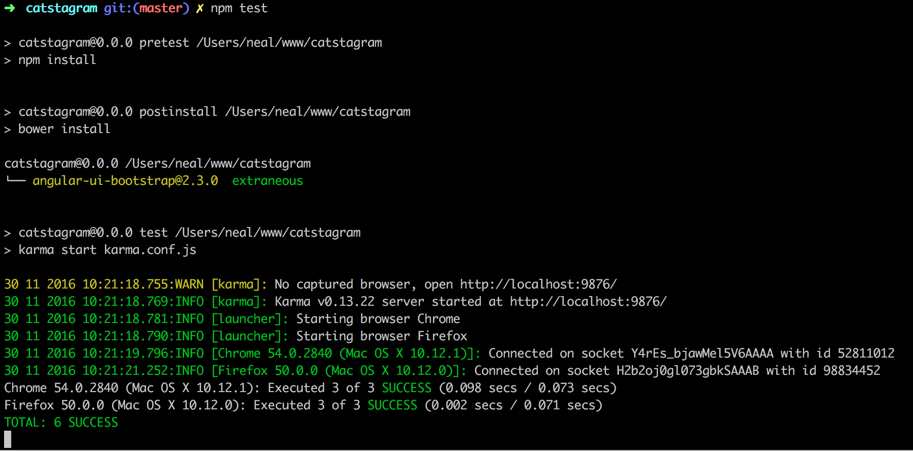
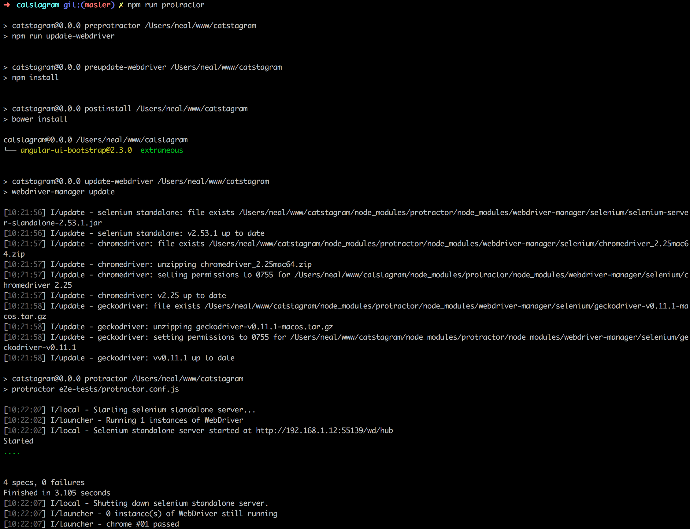

# Catstagram

## Installation

### Clone this repository
    $ git clone https://github.com/nealio82/catstagram.git

### Install PHP dependencies

Assuming you have Composer installed globally on your system, you can just run the composer command as described. If you don't have composer, you'll need to download and install it from [https://getcomposer.org/](https://getcomposer.org/). Follow these instructions to [put composer into a global location on your system]((https://getcomposer.org/doc/00-intro.md#globally)).

    $ cd catstagram
    $ composer install
    
### Install JS dependencies
    $ npm install
    
This will automatically kick off `bower install` as well 
    
## Setup some environment variables
You'll need to properly set up the environment variables, otherwise Laravel will get upset and will only show you errors.

Create a file called `.env` (note the leading '.') in the project root, right next to the `.env.example` file you can see.

And add the following content

    APP_ENV=local
    APP_KEY=base64:DDKhdua1ionbgPteyvCCA38Ls5sd16bLCDVd4aqj0SQ=
    APP_DEBUG=true
    APP_LOG_LEVEL=debug
    APP_URL=http://localhost
    PASTEBIN_KEY=[YOUR PASTEBIN API KEY]
    PASTEBIN_URI=http://pastebin.com/api/api_post.php
    
## The Application

Run the application as you wish, using Laravel's ```$ php artisan serve```, or the PHP built-in web server, or configure an Apache / Nginx host of your choice.

If you choose to use Laravel's ```$ php artisan serve```, you should go to [http://localhost:8000](http://localhost:8000) in your browser to see the application.

Pastebin api feedback is given to the user in the UI. Error feedback is shown in red boxes, successful transfers are shown in blue and contain a clickable link. 



#### App details:
- PHP backend: Laravel 5.3
- Frontend JS: Angular 1.5.9
- Frontend CSS: Bootstrap 3.3.7
- Dependency injection container is configured in [/app/Providers/AppServiceProvider.php](/app/Providers/AppServiceProvider.php)
- PHP tests: [/tests](/tests)
- PHP business logic code: [app/Model](app/Model)
- PHP controller: [/app/Http/Controllers/ApiController.php](/app/Http/Controllers/ApiController.php)
- Laravel framework routing: [/routes/web.php](/routes/web.php)
- Angular app files: [public/app](public/app)


## Testing

### PHP tests

PHP API acceptance tests and unit tests are performed with PHPUnit and are in the /tests directory. To run them, run PHPUnit

    $ php vendor/phpunit/phpunit/phpunit
    


### Javascript tests

JS tests are written using Angular's Jasmine framework for spec tests and Protractor for e2e testing.

#### Jasmine spec tests:

First you need to configure which browsers you have on your system in [karma.conf.js](karma.conf.js). If you have both Firefox and Chrome installed on your system for example, you can leave the config as it is. If you only have Chrome you should remove 'Firefox' from the config, and vice-versa.
  
Then run the test suite

    $ npm test
    

    
#### Protractor end-to-end tests
    
To run Protractor e2e tests, first you must run the NPM server

    $ npm start
    
And in a separate terminal window:

    $ npm run protractor
    

    
    
## Notes / Thoughts / Improvements

- The controller is coupled to the framework, albeit relatively loosely. It would be nice to implement PSR-7 compatible controllers, define them as services, and decouple completely from Laravel. I don't immediately know if Laravel provides an easy way to do this, or if trying so would be overkill for this project.
- I toyed with the idea of using Laravel's commandbus and dispatching domain events for user interactions, but again this seemed like overkill for the purposes of the tech test.
- The test cases is PastebinFileInfoUploaderTest.php pass the dependencies in a rather ugly way. They could be tidied.
- The uploaded URL notification could do with an auto-expire / remove on it to stop the page filling up with notifications.